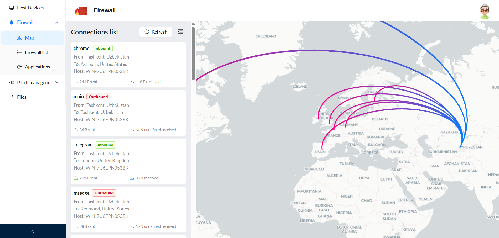
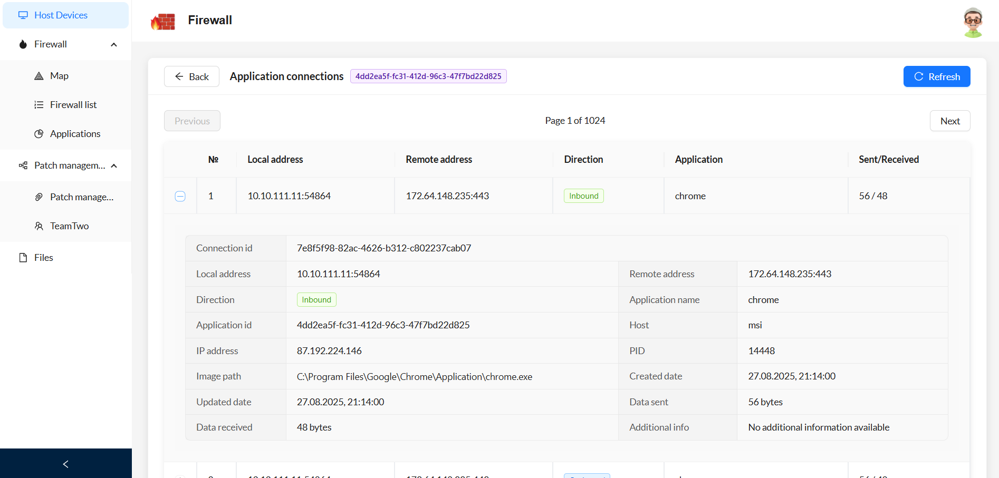
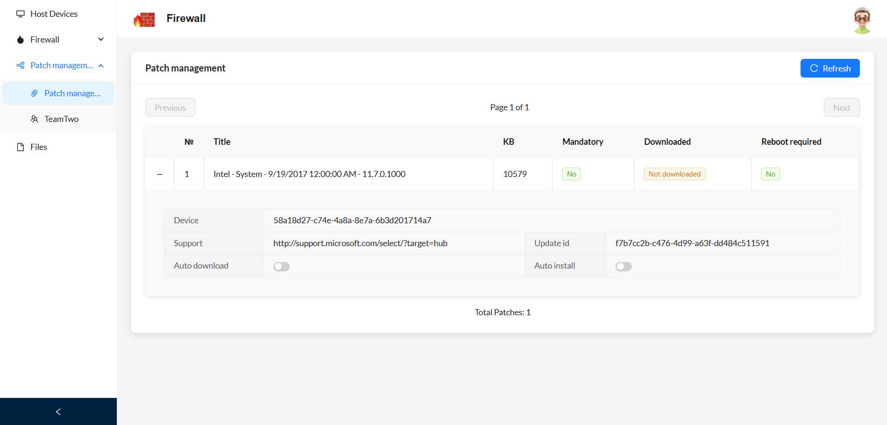

# Firewall Dashboard


Firewall Dashboard is a React-based web application designed to manage network devices, applications, and firewall rules.

## Key Features

- **Host Devices**: View all devices on the network, check their status and details.
- **Firewall Rules**: Create, delete, and edit firewall rules for devices and applications.
- **Applications**: Monitor installed applications on devices.
- **Patch Management**: Manage and view patch status for devices.
- **IP Address Map**: Visualize network connections on an interactive map.

## Getting Started

1. Make sure **Node.js** and **npm** are installed.
2. Run the following commands to start the project:
   ```sh
   npm install
   npm run dev
   ```





